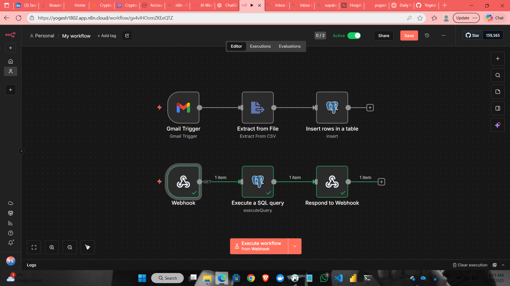

## 📌 Problem Statement
Hospitals often receive daily operational reports through email in CSV or Excel format.  
These reports must be manually downloaded, cleaned, and aggregated to track key KPIs such as:

- Inpatient admissions  
- ED attendances  
- ED wait times (>12 hrs)  
- Bed occupancy  
- ICU occupancy  
- Staff absence rates  

This manual workflow is:
- Time-consuming  
- Error-prone  
- Not scalable  
- Not real-time  
- Dependent on individuals  

As a result, hospital decision-makers lack **fast and reliable insights** for operational planning.

---

## 🚀 Solution Overview
This project automates the entire hospital KPI workflow from **email → database → API → dashboard**.

The system:
1. **Automatically extracts** CSV attachments from incoming emails  
2. **Parses and stores** the data into a database 
3. **Aggregates KPIs** using an n8n-powered Webhook API  
4. **Displays insights live** on a lightweight dashboard  

No manual work.  
No file downloads.  
Full automation.

---

##  Workflow Architecture

Gmail → n8n → CSV Extract → PostGreSQL Database
PostGreSQL Database → n8n Webhook API → SQL Aggregation → JSON Response → Dashboard (index.html)

## 🔄 Workflow Explanation

Every morning, hospitals send their daily KPI report by email.  
Instead of opening the email and downloading the CSV manually, the system steps in and handles everything automatically.

1. **The email arrives.**  
   n8n watches the mailbox and instantly detects the report.

   

3. **The file is extracted.**  
   The workflow opens the email, grabs the CSV attachment, and reads the data.

   

5. **The data is stored safely.**  
   n8n sends the cleaned rows into Supabase PostgreSQL, creating a growing history of daily metrics.

   

7. **The KPI API prepares insights.**  
   Another n8n workflow exposes a simple API:  
   you request a date → it runs an SQL query → it returns all KPIs for that day.

8. **The dashboard displays everything.**  
   The `index.html` page fetches these KPIs and shows them as cards on a clean, lightweight interface.

   
   

---

## 🛠️ Tools & Technologies
- **n8n** – Automation, ETL, and API orchestration  
- **Supabase PostgreSQL** – Cloud database  
- **HTML / CSS / JavaScript** – KPI dashboard  
- **Gmail** – Source of daily reports  
- **GitHub** – Code and documentation  

---

## 🎯 What This Project Achieves
- Fully automated KPI processing  
- Zero manual CSV handling  
- Real-time performance insights  
- Lightweight AI-style automation pipeline  
- Demonstrates ETL, APIs, SQL, automation, and frontend integration
